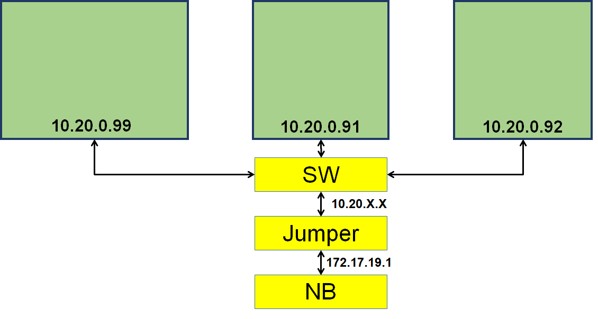
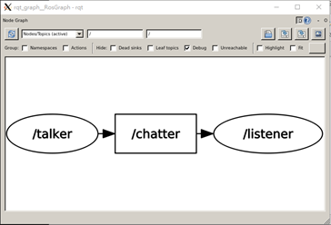
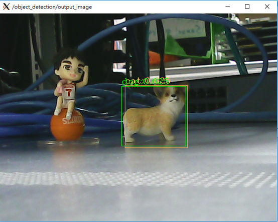
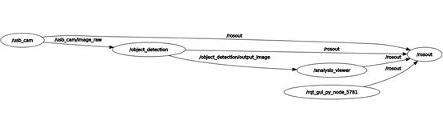
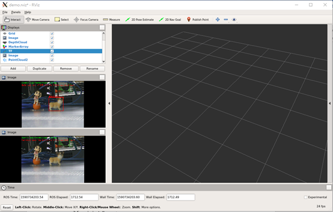
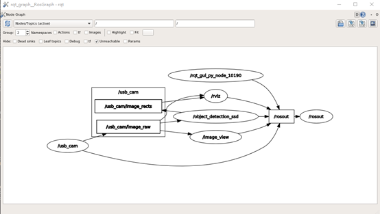
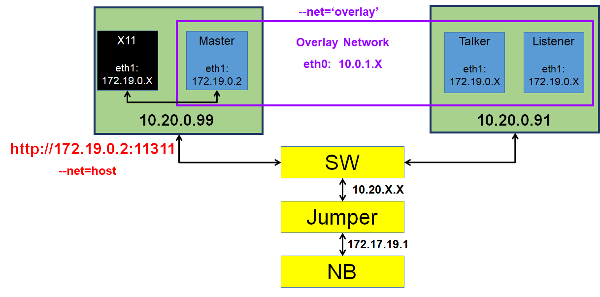
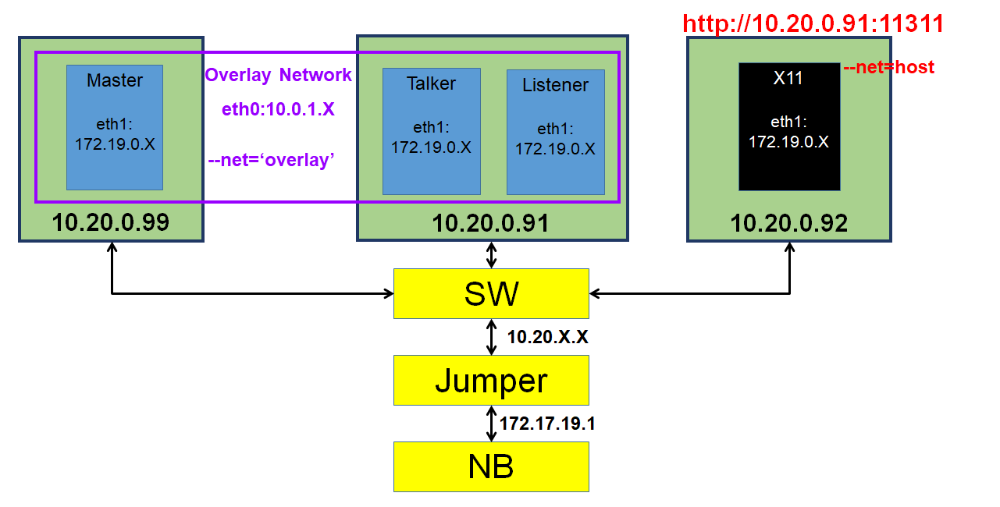

# ROS + OpenVINO + Docker

#### Information:

The outlines of this README file are listed below, specifically discussing the communications between ROS, OpenVINO, and Docker.

1. Communicaiton on same host machine
     	1. Communicate ROS in different containers on the same host machine
      2. ROS + OpenVINO in Docker 
      3. ROS + OpenVINO + Rviz in Docker
2. Communication on different host machines
     	1. Docker overlay network
      2. Iptable configuration
      3. ROS + OpenVINO + Rviz in Docker from multi host machines

#### Background:	

The situation is that I connected my local host to a jumper (172.17.19.1), which then connects to several servers (10.20.0.91 & 10.20.0.92 & 10.20.0.99). So it brings extra efforts to communicate between each servers.

#### Prerequisities:

1. Ubuntu 18.04

2. ROS melodic

3. OpenVINO v2020.2.120
4. Docker image: wilson850920/rosbaseopenvino:v1

#### Obstacles:

Running ROS in a docker container will also requires the container to display GUI surfaces or outputs. For testing the display function of the container, we use `$ xclock` as a tester. However, after testing both function inthe same container, we realized that ROS master node and X window can't work in the same contianer due to "--net" paramter setting. Luckily, this came be solve by using "iptable" configurations.

|              | ROS Master | Xwindow |
| ------------ | ---------- | ------- |
| --net = foo  | enable     | disable |
| --net = host | disable    | enable  |

 

## On the same host machine (10.20.0.99)

#### Communicate ROS in differnet container on the same host

1. ##### Create a docker network

   `$ docker network create go`

2. ##### Run master node container

   1. `$ docker run -itd --name master --rm --net=go wilson850920/rosbaseopenvino:v1`

   2.  `$ docker exec -it master bash`

      In the container

      1. `$ ifconfig`    find an ip simulate to 172.X.X.X. In my case, 172.24.0.7
      2. `$ export ROS_MASTER_URI=http://172.24.0.7:11311`
      3. `$ export ROS_HOSTNAME=172.24.0.7`
      4. `$ export ROS_IP=172.24.0.7` 
      5. `$ roscore`

3. ##### Run talker node container

   1. `$ docker run -itd --name talker --rm --net=host --env ROS_MASTER_URI=http://172.24.0.7:11311 --env ROS_HOSTNAME=10.20.0.99 --env ROS_IP=10.20.0.99 wilson850920/rosbaseopenvino:v1`

   2. `$ docker exec -it talker bash`

      In the container

      1. `$ cd /root/catkin_ws/src/testing/src`
      2. `$ python talker.py`

4. ##### Run listener node container

   1. `$ docker run -itd --name listener --rm --net=host --env ROS_MASTER_URI=http://172.24.0.7:11311 --env ROS_HOSTNAME=10.20.0.99 --env ROS_IP=10.20.0.99 wilson850920/rosbaseopenvino:v1`

   2. `$ docker exec -it listener bash`

      In the container

      1. `$ cd /root/catkin_ws/src/testing/src`
      2. `$ python listener.py`

5. ##### Run Xwindow node container

   1. `$ docker run -itd --name x11 --rm --net=host --env ROS_MASTER_URI=http:172.24.0.7:11311 --env ROS_HOSTNAME=10.20.0.99 --env ROS_IP=10.20.0.99 --volume="$HOME/.Xauthority:/root/.Xauthority:rw" --env="QT_X11_NO_MITSHM=1" --env="DISPLAY" wilson850920/rosbaseopenvino:v1`

   2. `$ docker exec -it x11 bash `

      In the container

      `$ rqt_graph`

      

      ​	Successfully display X window

6. ##### Run USB_cam for ROS

   1. `$ docker run -itd --rm --name cheese --net=host --env ROS_MASTER_URI=http://172.24.0.7:11311 --env ROS_HOSTNAME=10.20.0.99 --env ROS_IP=10.20.0.99 --env="DISPLAY" --volume="$HOME/.Xauthority:/root/.Xauthority:rw" --env="QT_X11_NO_MITSHM=1" --device=/dev/video0:/dev/video0:rwm --privileged wilson850920/rosbaseopenvino:v1`

   2. `$ docker exec -it cheese bash`

      In the container

      `$ roslaunch usb_cam-test.launch`

#### ROS + OpenVINO for Object-detection

 1. ##### Setup dependencies for environment

      1. `$ cd /root/catkin_ws/src`
      2. `$ git clone http://github.com/gbr1/ros_openvino.git`
      3. `$ cd ..`
      4. `$ catkin_make`
      5. `$ catkin_make install`
      6. `$ sudo apt-get install ros-melodic-usb-cam`

 2. ##### Edit launch file

     1. `$ cd /root/catkin_ws/src/ros_openvino/launch`

     2. `$ vim gpu_demo_webcam.launch`

        ​	line 25: change "GPU" to "CPU" 

 3. ##### Launch camera

    1. `$ roslaunch gpu_demo_webcam.launch`

    

    2. `$ rqt_graph`

    

#### ROS + OpenVINO + Rviz

1. ##### Setup dependencies

   1. `$ cd /root/catkin_ws/src`
   2. `$ git clone https://github.com/songshan0321/ros_vino.git`

2. ##### USB_cam configure

   1. `$ sudo apt-get install libarmadillo-dev`

   2. `$ cd /root/catkin_ws/src/ros_vino/include`

   3. `$ vim object_detection_ssd.h`

      1. line 24: change "#include </sample/common.hpp>" to "#include </opt/intel/openvino_2020.2.120/deployment_tools/inference_engine/samples/cpp/common/sample/common.hpp>
      2. line 25: change "#include </sample/ocv_common.hpp>" to "#include </opt/intel/openvino_2020.2.120/deployment_tools/inference_engine/samples/cpp/common/sample/ocv_common.hpp>

   4. `$ vim /opt/intel/openvino_2020.2.120/deployment_tools/inference_engine/samples/cpp/common/samples/ocv_common.hpp`

      ​	line 12: change the path to absolute path for common.hpp

3. ##### Edit launch file 

   1. `$ cd /root/catkin_ws/src/ros_vino/launch`

   2. `$ vim object_detection_ssd.launch`

      1. line 4: change "camera/color/image_raw" to "usb_cam/image_raw"
      2. line 5: change "camera/image_rects" to "usb_cam/image_rects"

   3. `$ cd ../rviz`

   4. `$ vim demo.rviz`

      ​		line 58, 81, 85, 130: change "camera/..." to "usb_cam/..." as above 

4. ##### Launch function

   1. `$ sudo apt-get install ros-melodic-rviz`

   2. `$ cd /root/catkin_ws`

   3. `$ catkin_make`

   4. `$ cd /root/catkin_ws/src/ros_vino/launch`

   5. `$ roslaunch object_detection_ssd.launch`

      

      

## Communication on different host machine 

There are two cases of connection on different host machines. One by using docker overlay network, the other by setting iptable configuration. The host machines are 10.20.0.99, 10.20.0.91, and 10.20.0.92. 

### Docker overlay network

Although its docker overlay network, it is actually a kind of docker swarm.

#### Master node, talker node, and listener node (99 & 91)

Settings: Server 99: Master node. Server 91: Talker node and listener node

On server 99: 

1.  Start docker swarm

   `$ docker swarm init`

​		 Copy the command from the output  `docker swarm join --token SWMTKN-1-1ydidu2awbl398mpquej0c41804i867fst6hmpdssyjpuvuln8-3wvxwvt68fiyuecpuzmgzelbz 172.17.19.1:2377`

2.  Create overlay network

   `$ docker network create --driver=overlay --attachable test-net`

3.  Start master node

   `$ docker run -it --name master --network test-net -p 11311:11311 wilson850920/rosbaseopenvino:v1`

   In the container

   1. `$ ifconfig`  The IP if this container is eth0=10.0.1.6 and eth1=172.19.0.2, note that the IP won't be exactly the same on every machine, locate to eth0 and eth1 for a more precise way.
   2. `$ export ROS_MASTER_URI=http://10.0.1.6:11311`
   3. `$ export ROS_HOSTNAME=10.0.1.6`
   4. `$ export ROS_IP=10.0.1.6`
   5. `$ roscore`

On server 91:

1. Start talker node 
   1. `$ docker swarm join --token SWMTKN-1-1ydidu2awbl398mpquej0c41804i867fst6hmpdssyjpuvuln8-3wvxwvt68fiyuecpuzmgzelbz 172.17.19.1:2377`
   2. `$ docker run -it --name talker --network test-net wilson850920/rosbaseopenvino: v1`
   3. `$ ifconfig`  Container IP for talker node is 10.0.1.4
   4. `$export ROS_MASTER_URI=http://10.0.1.6:11311 ROS_HOSTNAME=10.0.1.4 ROS_IP=10.0.1.4`
   5. `$ cd /root/catkin_ws/src/testing/src`
   6. `$ python talker.py`
2. Start listener node 
   1. `$ docker swarm join --token SWMTKN-1-1ydidu2awbl398mpquej0c41804i867fst6hmpdssyjpuvuln8-3wvxwvt68fiyuecpuzmgzelbz 172.17.19.1:2377`
   2. `$ docker run -it --name listener --net test-net wilson850920/rosbaseopenvino:v1`
   3. `$ ifconfig` Container IP for listener node is 10.0.1.8
   4. `$ export ROS_MASTER_URI=http://10.0.1.6:11311 ROS_HOSTNAME=10.0.1.8 ROS_IP=10.0.1.8`
   5. `$ cd /root/catkin_ws/src/testing/src`
   6. `$ python listener.py`

Keypoint: set ROS_MASTER_URI as the master node IP, ROS_HOSTNAME and ROS_IP as self node IP.

#### Master node and X11 node on the same host (99 & 91)

The setting for master, talker, and listener node are as same as "Master node, talker node, and listener node (99 & 91)" above. The following shows how to start up a container that connects to ROS and can display GUI. 

​			On server 99:

​			`$ docker run -it --name x11 --rm --net=host  --env=DISPLAY=$DISPLAY --env="QT_X11_NO_MITSHM=1" --volume="$HOME/.Xauthority:/root/.Xauthority:rw" wilson850920/rosbaseopenvino:v1`

​			`$ export ROS_MASTER_URI=http://172.19.0.2:11311 ROS_HOSTNAME=10.20.0.99 ROS_IP=10.20.0.99`

Note that the ROS_MASTER_URI should be set to the another IP(172.19.0.2) of the Master node container instead of the overlay network IP(10.0.1.6).

​			`$ rostopic list` Check whether connect to ROS master

​			`$ rqt_graph`

#### Master node and X11 node on a different host (99 & 91 & 92)

​			On server 92: 

​			`$ docker run -it --name x11 --rm --net=host  --env=DISPLAY=$DISPLAY --env="QT_X11_NO_MITSHM=1" --volume="$HOME/.Xauthority:/root/.Xauthority:rw" wilson850920/rosbaseopenvino:v1`

​			`$ export ROS_MASTER_URI=http://10.20.0.91:11311 ROS_HOSTNAME=10.20.0.92 ROS_IP=10.20.0.92`

​			`$rostopic list` Chech whether connect to ROS master

​			`$rqt_graph` 

​	Note that the ROS_MASTER_URI should be set to server IP(10.20.0.99)

### Iptable settings (solve the obstacles)

Server 99: master, listener. Server 91: talker, x11

On server 99:

​			`$docker network create final` 

​			On server 99, iptable settings

​				`$ ifconfig | grep -B 1 10.20.0.99` Find your relate network card (enp25s0d1)

​				`$ sudo iptables -t nat -I PREROUTING -p tcp -i enp25s0d1 --dport 11311 -j DNAT --to 172.26.0.2:11311`

​				`$ sudo iptables -I FORWARD -p tcp --sport 11311 -j ACCEPT`

​			Master node:

​				`$ docker run -itd --name master --rm --net=final -p 11311:11311 wilson850920/rosbaseopenvino:v1`

​				`$ docerk exec -it master bash`

​				In the container:

​					`$ifconfig` Find the IP 172.26.0.2

​					`$ export ROS_MASTER_URI=http://172.26.0.2:11311 ROS_HOSTNAME=172.26.0.2 ROS_IP=172.26.0.2`

​					`$ roscore`

​			Talker node:

​				`$ docker run -itd --name talker --rm --net=host --env="DISPLAY" --env="QT_X11_NO_MITSHM=1" --volume="$HOME/.Xauthority:/root/.Xauthority:rw" --env ROS_MASTER_URI=http://172.26.0.2:11311 --env ROS_HOSTNAME=10.20.0.99 --env ROS_IP=10.20.0.99 wilson850920/rosbaseopenvino:v1 `

​				`$ docker exec -it talker bash`

​					In the container: 

​					`$ cd /root/catkin_ws/src/testing/src`

​					`$ python talker.py`

​	On server 91: 

​		Iptable connection

​			`$ nc -zv 10.20.0.99 11311`  Reponse "Connection to 10.20.0.99 11311 port [tcp/*] succeeded!" means successfully connect to server 99.

​				Listener node:

​				`$ docker run -itd --name listener --rm --net=host --env="DISPLAY" --env="QT_X11_NO_MITSHM=1" --volume="$HOME/.Xauthority:/root/.Xauthority:rw" --env ROS_MASTER_URI=http://172.26.0.2:11311 --env ROS_HOSTNAME=10.20.0.99 --env ROS_IP=10.20.0.99 wilson850920/rosbaseopenvino:v1 `

​				`$ docker exec -it listener bash`

​					In the container:

​						`$ cd /root/catkin_ws/src/testing/src`

​						`$ rqt_graph`

​						`$ python listener.py`	

​			Now the container may be able to connect to ROS and display X window simultaneously.

### Current tasks: capture video from different host machines

